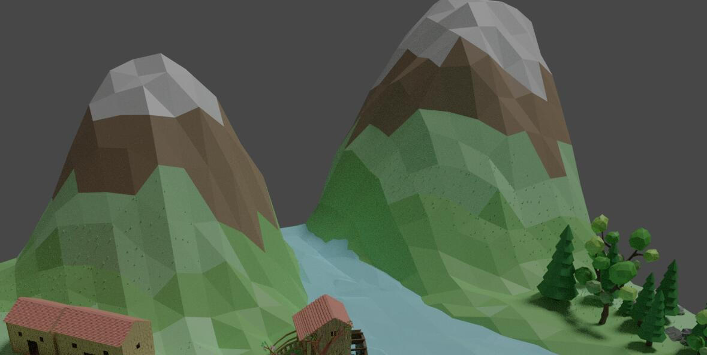

## 计算机图形学期末报告

1. 项目介绍以及实现结果
   
     本项目旨在自创一个好看的场景，允许玩家控制角色以观察者视角自由游览

2. 开发环境和用到的第三方库
   
   编程环境：
   
   建模环境：WIN10 + blender2.8  

3. 建模
   
   建模参考了很多网上的教程，很多模型都是照着教程一步一步做的
   
   - 水池及好看的树：
     
     效果：
     
     
     
     教程链接：[春天的小溪景]([https://www.bilibili.com/video/av48987021?from=search&seid=8955813736874775450](https://www.bilibili.com/video/av48987021?from=search&seid=8955813736874775450)
     
     教程关键点：雕刻的方法给石头建模，树干形态建模（包括曲折样式和局部缩放），树枝和树叶的建模及打包复用，花的建模和紧贴平面摆放，通过旋转缩放把一个石头模型活用成多个不同的效果
   
   - 带滚筒的木房：
     
     效果：
     
     
     
     教程链接（这个视频用了很多blender的高级用法，挺厉害的）：
     
     <https://www.bilibili.com/video/av48070933?from=search&seid=12085032239476015364>
     
     教程关键点：利用阵列修改器做出排列的木板效果，窗户，门等的切割，房顶的建模，将屋子两边的木板拉成三角状，楼梯的建模，滚筒的建模（用了很多高级的技能），总之这个模型的难度应该是最大的，但效果确实比较满意，其他的木房子是按照这个房子的做法简单做完一个然后复制缩放完成的
   
   - 桥：
     
     效果：
     
     
     
     教程链接（只看了桥的部分）：<https://www.bilibili.com/video/av47463302?from=search&seid=572303045645818282>
     
     教程关键点：利用镜像完成桥的两边
   
   - 云：
     
     效果：
     
     
     
     教程链接：<https://www.bilibili.com/video/av7574028/?p=8>
     
     教程关键点：无，只要将圆球随机排列就行了
   
   - 水井：
     
     效果：
     
     
     
     这个是纯粹自己瞎做的，没链接
   
   - 树：
     
     效果：
     
     
     
     
     
     教程链接：<https://www.bilibili.com/video/av20616058?from=search&seid=572303045645818282>
     
     教程关键点：松树叶子做法，另一种树看着自然就OK
   
   - 地形：
     
     效果：
     
     
     
     教程链接：<https://www.bilibili.com/video/av40930459?from=search&seid=15558398973843883184>
     
     教程关键点：low-poly效果的体现，山地的建模，水的建模
   
   - 地形中的小草：
     
     效果：
     
     
     
     教程链接：https://www.bilibili.com/video/av48987021?from=search&seid=8955813736874775450
     
     教程关键点：权重绘制，粒子系统
   
   - 雪景（可能没用上，但是太有技巧了）
     
     效果：
     
     
     
     教程链接：<https://www.bilibili.com/video/av20616058?from=search&seid=572303045645818282>
     
     教程关键点：雪被子的做法就是将原来的模型拷贝一份涂成全白然后稍微往上拉一点，对于大多数模型这种做法效果都是不错的，不过中间那些树的效果不太好
   
   - 全景图：
     
     
     
     
   
   - 天空盒
     
     本来自制了几张好看的天空盒的，但是由于邻接处衔接很不自然，所以只能退而求其次，用了纯天空的模型做了天空盒
     
     天空盒制作全景：
     
     
     
     前：
     
     
     
     后：
     
     
     
     左：
     
     
     
     右：
     
     
     
     上：
     
     
     
     下：
     
     

4. 实现功能列表
   
   1. Basic
      
      - Camera Roaming
      
      - Simple lighting and shading
      
      - Texture mapping
      
      - Shadow mapping
      
      - Model import & mesh viewing
   
   2. Bonus
      
      - Sky Box
      
      - Gamma 矫正

5. 实现功能点简单介绍
   
   - Basic
     
     - Camera Roaming
     
     - Simple lighting and shading
     
     - Texture mapping

     - Shadow mapping
    
    
    
     - Model importing & mesh viewing

- Bounus
  
  - Sky Box
  
  - Gamma 矫正
6. 遇到的问题和解决方案

7. 小组成员贡献和分工
   
   | 分工  | 戴馨乐 | 张根  |
   |:---:|:---:|:---:|
   | 建模  | 10% | 90% |
   | 代码  | 90% | 10% |
   | 合计  | 50% | 50% |
