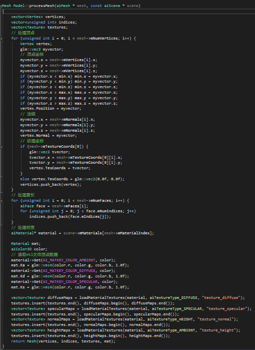
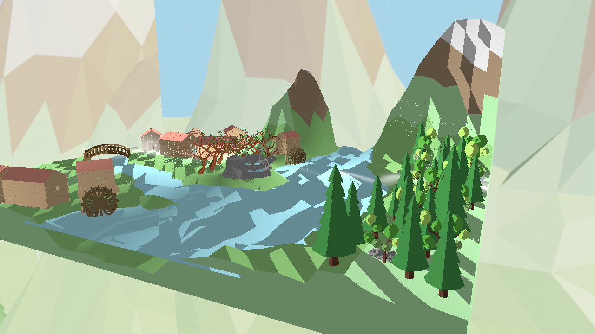

## 计算机图形学期末报告

1. <b>项目介绍以及实现结果</b>
   
     本项目旨在自创一个好看的场景，允许玩家控制角色以观察者视角自由游览

2. <b>开发环境和用到的第三方库</b>
   
   编程环境：Win10 +GLFW库 + glad库
   
   建模环境：Win10 + blender2.8
   
   第三方库：
   
   1. Assimp库
   
   2. stb_image库
   
   3. glm库

3. <b>建模</b>
   
   建模参考了很多网上的教程，很多模型都是照着教程一步一步做的
   
   - 水池及好看的树：
     
     效果：
     
     
     
     教程链接：<https://www.bilibili.com/video/av48987021?from=search&seid=8955813736874775450>
     
     教程关键点：雕刻的方法给石头建模，树干形态建模（包括曲折样式和局部缩放），树枝和树叶的建模及打包复用，花的建模和紧贴平面摆放，通过旋转缩放把一个石头模型活用成多个不同的效果
   
   - 带滚筒的木房：
     
     效果：
     
     
     
     教程链接（这个视频用了很多blender的高级用法，挺厉害的）：
     
     <https://www.bilibili.com/video/av48070933?from=search&seid=12085032239476015364>
     
     教程关键点：利用阵列修改器做出排列的木板效果，窗户，门等的切割，房顶的建模，将屋子两边的木板拉成三角状，楼梯的建模，滚筒的建模（用了很多高级的技能），总之这个模型的难度应该是最大的，但效果确实比较满意，其他的木房子是按照这个房子的做法简单做完一个然后复制缩放完成的
   
   - 桥：
     
     效果：
     
     
     
     教程链接（只看了桥的部分）：<https://www.bilibili.com/video/av47463302?from=search&seid=572303045645818282>
     
     教程关键点：利用镜像完成桥的两边
   
   - 云：
     
     效果：
     
     
     
     教程链接：<https://www.bilibili.com/video/av7574028/?p=8>
     
     教程关键点：无，只要将圆球随机排列就行了
   
   - 水井：
     
     效果：
     
     
     
     这个是纯粹自己瞎做的，没链接
   
   - 树：
     
     效果：
     
     
     
     
     
     教程链接：<https://www.bilibili.com/video/av20616058?from=search&seid=572303045645818282>
     
     教程关键点：松树叶子做法，另一种树看着自然就OK
   
   - 地形：
     
     效果：
     
     
     
     教程链接：<https://www.bilibili.com/video/av40930459?from=search&seid=15558398973843883184>
     
     教程关键点：low-poly效果的体现，山地的建模，水的建模
   
   - 地形中的小草：
     
     效果：
     
     
     
     教程链接：https://www.bilibili.com/video/av48987021?from=search&seid=8955813736874775450
     
     教程关键点：权重绘制，粒子系统
   
   - 雪景（可能没用上，但是太有技巧了）
     
     效果：
     
     
     
     教程链接：<https://www.bilibili.com/video/av20616058?from=search&seid=572303045645818282>
     
     教程关键点：雪被子的做法就是将原来的模型拷贝一份涂成全白然后稍微往上拉一点，对于大多数模型这种做法效果都是不错的，不过中间那些树的效果不太好
   
   - 全景图：
     
     
     
     
   
   - 天空盒
     
     本来自制了几张好看的天空盒的，但是由于邻接处衔接很不自然，所以只能退而求其次，用了纯天空的模型做了天空盒
     
     天空盒制作全景：
     
     
     
     前：
     
     
     
     后：
     
     
     
     左：
     
     
     
     右：
     
     
     
     上：
     
     
     
     下：
     
     

4. <b>实现功能列表</b>
   
   1. Basic
      
      - Camera Roaming
      
      - Simple lighting and shading
      
      - Texture mapping
      
      - Shadow mapping
      
      - Model import & Mesh viewing
   
   2. Bonus
      
      - Sky Box
      
      - Gamma 矫正

5. <b>实现功能点简单介绍</b>
   
   1. Basic
      
      - Camera Roaming
        
        通过监听输入函数，通过上下左右的方向键改变摄像机的位置。摄像机位置的改变会影响lookAt矩阵，将物体的view矩阵设为该lookAt矩阵就可以实现摄像头的自由移动。
        
        核心代码如下：
        
        ```
        Camera.h
        ```
        
        
        
        ```
        Camera.cpp
        ```
        
        
        
        
        
        使用Camera的lookAt矩阵作为观察物体的view矩阵：
        
        
        
        结果：
        
        
      
      - Simple lighting and shading
        
        Phong光照模型分为3个部分组成：
        
        1. 环境光照
           
           通过一个常量的环境因子，乘以物体的颜色，就可以得到环境光照
           
           
        
        2. 漫反射光照
           
           通过法向量，可以得到该光线以什么角度接触到这个片段，这个角度可以作为因子，使得不同角度面向光线，照亮的情况不一样。这就是漫反射。
           
           所以，首先要将法向量标准化，得到光线的方向向量，然后通过点乘得到该片段面向光源的角度，从而这个角度作为因子决定了该面被照亮的情况。
           
           
        
        3. 镜面光照
           
           镜面光照由法向量和入射向量决定，不同的是，它还由观察的方向决定。所以是通过reflect( )函数来得到光线向量关于法向量对称的射出向量，通过射出向量和观察向量的点乘得到两者的角度，从而决定了物体在观察者眼中被照亮的情况。
           
           
           
           结果演示：
           
           
      
      - Texture mapping
        
        由于建模是采用顶点上色的方式，所以没有用到贴图。这部分内容在Bonus做天空盒的时候有用到。
      
      - Shadow mapping
        
        阴影映射借助深度测试，将深度贴图作为一个纹理绑定在场景中，从而计算出阴影值。
        
        阴影映射分为2步：
        
        1. 生成深度贴图
           
           创建一个帧缓冲以及一个供帧缓冲的深度缓冲使用的2D纹理。然后在渲染循环中，设置好光源空间的变换矩阵lightSpaceMatrix和model矩阵，绑定帧缓冲，使用深度缓冲的Shader来渲染场景，从而得到了深度贴图
           
           
           
           
           
           深度缓冲的Shader的顶点着色器和片段着色器就很简单了，顶点着色器简单进行位置变换，由于没有用到颜色，所以片段着色器为空。
           
           ```
           Shadow_Depth.vs
           ```
           
           
           
           ```
           Shadow_Depth.fs
           ```
           
           
        
        2. 将深度贴图作为纹理渲染进入场景
           
           将深度贴图作为纹理绑定，然后Shader中，通过采样器sampler2D来获取对应的深度值，从而计算阴影。
           
           
           
           计算阴影值：
           
           
           
           
           
           结果演示：
           
           
      
      - Model import & Mesh viewing
        
        模型导入借助的是第三方的库：Assimp库。我们的模型导出成.obj文件和.mtl文件供Assimp库读取。
        
        .obj文件包含的是顶点的数据，包括该模型的顶点，组成的三角形的索引以及使用的对应的.mtl文件。
        
        .mtl文件则包含了使用到的纹理图片（假如有的话）以及该面对应的3中光照下的颜色。
        
        Assimp库读取这些数据，然后组成了下面这种树状的数据结构：
        
        
        
        该库将模型加载入Scene对象中，然后又包含了顶点数据，索引数据，材料数据等，通过上面这张图，可以将数据获取，然后绑定顶点，所以，纹理等的坐标，读取mtl文件获取顶点的颜色，供Shader使用。
        
        Mesh：Mesh包含了顶点数据，法向量，纹理坐标等数据，一个网格包含了很多个face，face表示的是图元，这里我们是三角形Triangle，然后通过索引缓冲来渲染。
        
        1. Model Import
           
           通过上图这个树状结构，很自然可以想到用递归的方式来获取数据
           
           ```
           Model.h
           ```
           
           
           
           ```
           Model.cpp
           ```
           
           1. 载入模型，获得Scene对象，然后调用函数去处理Node
              
              
           
           2. 一个Node包含多个Mesh，通过循环来处理该Node中的所有Mesh，处理完之后，逐个去处理子Node
              
              
           
           3. 获取Mesh所包含的数据，然后送入新建的Mesh对象中
              
              
        
        2. Mesh Viewing
           
           ```
           Mesh.h
           ```
           
           
           
           用一个Struct结构来管理顶点数据和材料数据
           
           
           
           ```
           Mesh.cpp
           ```
           
           在Mesh对象中就是和前面一样的过程，绑定顶点，设置顶点属性等
           
           
           
           渲染的话，在Model的Draw函数中循环调用Mesh中的Draw函数，在Mesh中，就和前面一样渲染顶点出来就可以了
           
           ```
           Model中的Draw函数
           ```
           
           
           
           ```
           Mesh中的Draw函数
           ```
           
           
           
           结果演示：
           
           
   
   2. Bonus
      
      - Sky Box
        
        天空盒其实就是一个立方体，然后将上下左右前后6张天空盒图片作为纹理贴图，贴在了立方体上。
        
        为了使得天空盒仿佛无限大，所以需要将变换矩阵中的位移部分给去掉，这样无论摄像头如何移动，对于天空盒的渲染都不会产生位移，从而摄像头就无法靠近天空盒的6个面，就有了场景仿佛无限大的错觉。
        
        那么该如何使得不会产生位移？
        
        我们原先的View矩阵，是一个4✖4的矩阵，将View矩阵削减成一个3✖3的矩阵，就将最后一列的位移给去掉了。但是我们需要的是4✖4的矩阵，所以最后将矩阵变换回4×4的矩阵。
        
        
        
        结果演示：
        
        
      
      - Gamma 矫正
        
        需要Gamma矫正的原因是，我们前面的工作都是线性的，然而人眼的感知是非线性的，所以需要Gamma矫正，将线性的结果映射到非线性的Gamma曲线上，使得结果更加真实。
        
        OpenGL默认是带有Gamma矫正的，但是默认是关闭的，所以只需要设为TRUE打开Gamma矫正，就可以了。当然这种方法并不灵活不受我们的控制，修改着色器可以更加灵活控制Gamma矫正的结果。
        
        下面对比未开启Gamma矫正和开启Gamma矫正：
        
        - 开启Gamma矫正之前
          
          
        
        - 开启Gamma矫正之后
          
          
          
          可以看到，开启了Gamma矫正之后，场景的光照情况更加自然真实

6. <b>遇到的问题和解决方案</b>
   
   1. 模型过大，载入出现内存不足的错误
      
      解决方案：
      
      一开始我们是将模型一整个导出，发现内存不足。后来经查找资料得知，我们的GLFW库仅仅兼容x86模式，x86模式是运行在32bit机器上的，内存最大就是2G，假如整个模型导入会出现内存不足的错误。但是我们可以将模型在blender中，分成一些小部分来导入，这样就可以解决这个内存不足的问题。
      
      
   
   2. 教程中使用的是纹理贴图的形式，我们采用的是顶点上色，完全按照教程的做法无法导入颜色
      
      解决方案：
      
      虽然没有贴图，但是颜色的数据还是保存在mtl文件里面的，所以除了从obj文件里面获取顶点数据等之外，Scene对象还包含了指向对应Material对象的指针，这里就可以获取到了需要的颜色值，将其送入Mesh就可以了。
      
      

7. <b>运行演示</b>
   
   

8. <b>小组成员贡献和分工</b>
   
   | 分工  | 戴馨乐 | 张根  |
   |:---:|:---:|:---:|
   | 建模  | 10% | 90% |
   | 代码  | 90% | 10% |
   | 合计  | 50% | 50% |
