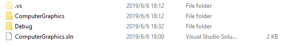
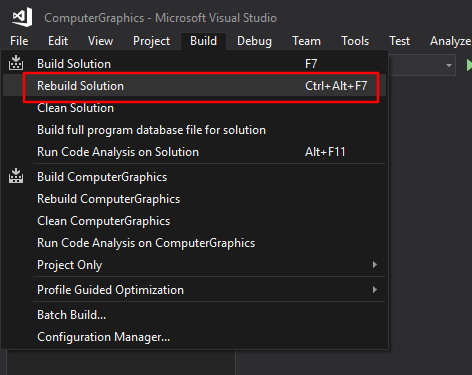
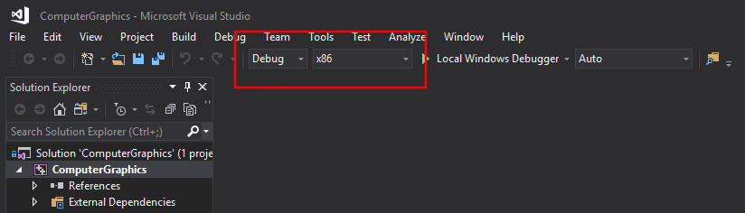
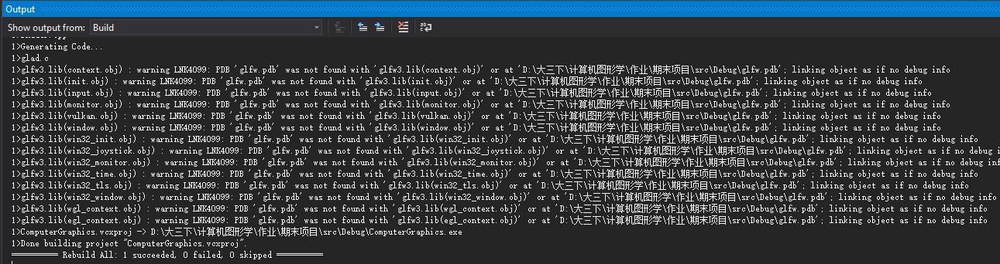
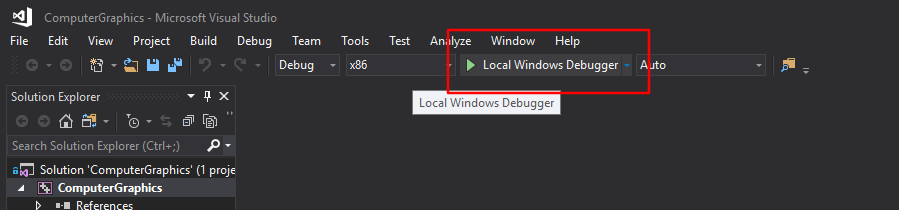
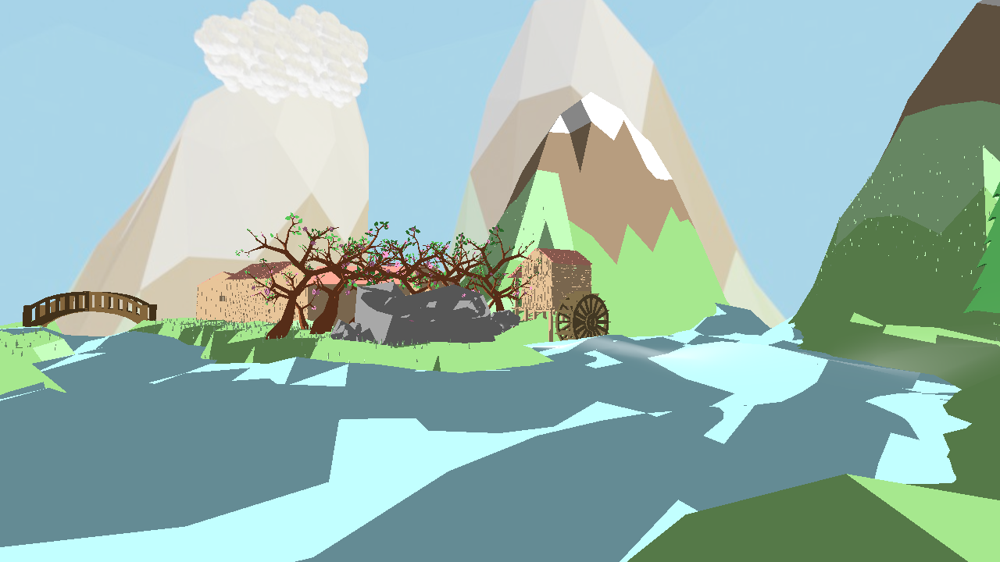
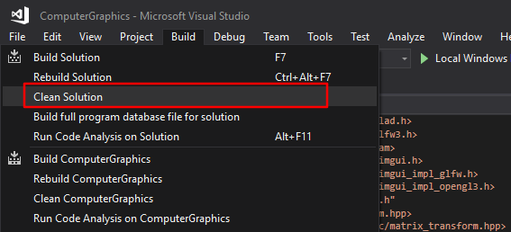

## Complete Project

下载到本地，然后进入项目

    git clone https://github.com/AnselDai/ComputerGraphicsFinalProject.git
    cd ComputerGraphicsFinalProject/project

1) 使用Visual Studio打开ComputerGraphics.sln

2) 然后重建解决方案，记得选择x86模式

3) 运行

<b>！！上传之前务必清理解决方案再上传，否则可能因为文件过大失败</b>

